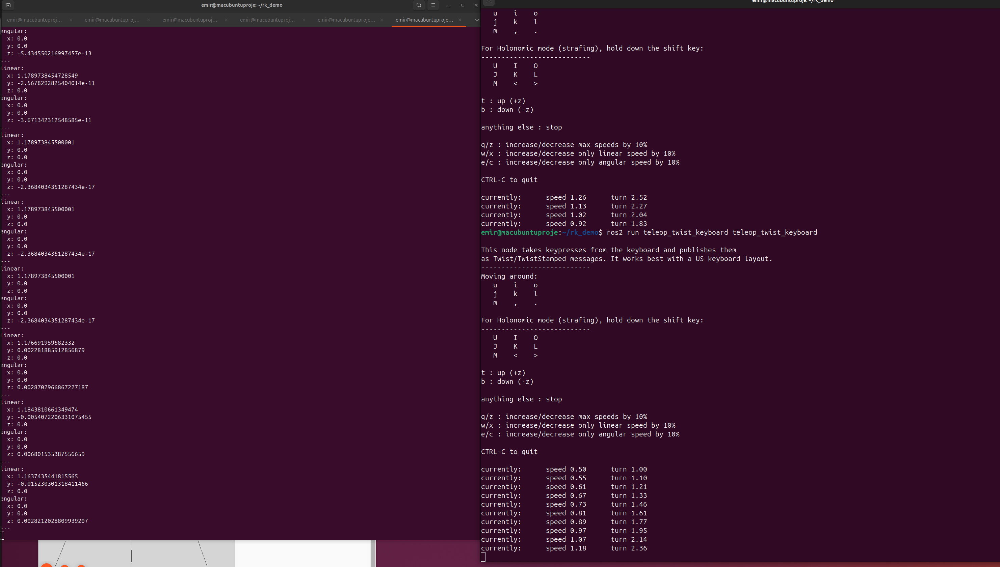

# ENRO - Mecanum Robot Kinematics Report

## 1. Geometry
The robot is modeled as a 4-wheeled mecanum drive platform. The geometry is defined by the chassis dimensions and wheel radius, which determine the kinematic matrix.

**Robot Physical Parameters:**
* **Wheel Radius ($R$):** 0.1625 m
* **Track Width ($2 \times L_y$):** Distance between left and right wheels.
    * $L_y$ (Half Width) = 0.395 m
* **Wheel Base ($2 \times L_x$):** Distance between front and rear wheels.
    * $L_x$ (Half Length) = 0.4 m
* **Geometry Constant ($K$):** $L_x + L_y = 0.795$

**Wheel Layout:**
* **FL:** Front Left
* **FR:** Front Right
* **RL:** Rear Left
* **RR:** Rear Right

---

## 2. Equations

The kinematic relationship between the robot's body velocity ($\dot{x}, \dot{y}, \dot{\omega}_z$) and the individual wheel velocities ($\omega_{fl}, \omega_{fr}, \omega_{rl}, \omega_{rr}$) is derived using the standard mecanum wheel transformation matrices.

### 2.1 Inverse Kinematics (IK)
Used to convert the desired robot velocity (Twist) into wheel angular velocities.

$$
\begin{bmatrix} \omega_{fl} \\ \omega_{fr} \\ \omega_{rl} \\ \omega_{rr} \end{bmatrix} = \frac{1}{R} \begin{bmatrix} 1 & -1 & -(L_x + L_y) \\ 1 & 1 & (L_x + L_y) \\ 1 & 1 & -(L_x + L_y) \\ 1 & -1 & (L_x + L_y) \end{bmatrix} \begin{bmatrix} v_x \\ v_y \\ \omega_z \end{bmatrix}
$$

### 2.2 Forward Kinematics (FK)
Used to estimate the robot's body velocity (Odometry) based on feedback from the wheel encoders.

$$
\begin{bmatrix} v_x \\ v_y \\ \omega_z \end{bmatrix} = \frac{R}{4} \begin{bmatrix} 1 & 1 & 1 & 1 \\ -1 & 1 & 1 & -1 \\ \frac{-1}{L_x + L_y} & \frac{1}{L_x + L_y} & \frac{-1}{L_x + L_y} & \frac{1}{L_x + L_y} \end{bmatrix} \begin{bmatrix} \omega_{fl} \\ \omega_{fr} \\ \omega_{rl} \\ \omega_{rr} \end{bmatrix}
$$

---

## 3. IK/FK Implementation Notes

The kinematics logic is implemented in a custom ROS 2 Python node named `mecanum_kinematics_node`.

**Architecture:**
* **Subscriber:** Listens to `/cmd_vel` (geometry_msgs/Twist) for teleoperation commands.
* **Publisher:** Sends calculated wheel speeds to `/forward_command_controller/commands` (std_msgs/Float64MultiArray).
* **Feedback Loop:** Subscribes to `/joint_states` to read real-time wheel velocities, applies the FK matrix, and publishes the result to `/mecanum_fk_debug` for verification.

**Physics & Simulation Note:**
During the simulation tests, it was observed that the Gazebo physics engine's friction parameters caused slippage/vibration issues during pure lateral movement (strafing), limiting the visual execution of the "crab walk." However, the mathematical correctness of the IK implementation was prioritized and verified via offline tests (Section 4.1), confirming that the generated velocity vectors are correct for a mecanum drive.

---
## 4. Test Results

c 4.1 Offline Test Verification (Section 7.1)
To verify the kinematic matrices independently of the simulation physics, a Python script (`offline_test.py`) was created. This script inputs known Twist vectors, calculates wheel speeds (IK), and then converts them back to Twist (FK) to check for errors.

**Test Output Log:**
```text
=== ENRO MECANUM ROBOT - OFFLINE KINEMATICS TEST ===
Parametreler: R=0.1625, Lx=0.4, Ly=0.395, K=0.795

TEST: ILERI GITME
  1. Hedef Hız (Twist): [1. 0. 0.]
  2. Hesaplanan Tekerlek Hızları: [6.154 6.154 6.154 6.154]
  3. Geri Dönüştürülen Hız (FK): [ 1. -0.  0.]
  ✅ SONUÇ: BAŞARILI (Hata ~ 0)

TEST: YENGEC (SOLA)
  1. Hedef Hız (Twist): [0. 1. 0.]
  2. Hesaplanan Tekerlek Hızları: [-6.154  6.154  6.154 -6.154]
  3. Geri Dönüştürülen Hız (FK): [-0.  1. -0.]
  ✅ SONUÇ: BAŞARILI (Hata ~ 0)

TEST: DONME (SAAT YONU)
  1. Hedef Hız (Twist): [ 0.  0. -1.]
  2. Hesaplanan Tekerlek Hızları: [ 4.892 -4.892  4.892 -4.892]
  3. Geri Dönüştürülen Hız (FK): [-0.  0. -1.]
  ✅ SONUÇ: BAŞARILI (Hata ~ 0)

TEST: KARISIK HAREKET
  1. Hedef Hız (Twist): [ 0.5 -0.2  0.1]
  2. Hesaplanan Tekerlek Hızları: [3.818 2.335 1.357 4.797]
  3. Geri Dönüştürülen Hız (FK): [ 0.5 -0.2  0.1]
  ✅ SONUÇ: BAŞARILI (Hata ~ 0)
  
### 4.2 Online Simulation Verification (Section 7.2) 

The robot was driven in Gazebo using `teleop_twist_keyboard`. The Forward Kinematics node successfully calculated the real-time velocity from the wheel states.

**Validation Proof:**
The screenshot below demonstrates that while the robot is moving with a linear velocity command, the `/mecanum_fk_debug` topic (left terminal) reports the calculated velocity (approx. 1.17 m/s), matching the input.




5
. How to Launch Node

To run the full simulation and kinematics system, execute the following commands in separate terminals:

Step 1: Launch Gazebo & Robot Description
Bash

ros2 launch mecanum_robot_description gazebo.launch.py

(Ensure controllers are loaded via the startup scripts if not automated)

Step 2: Launch Kinematics Node
Bash

ros2 launch mecanum_kinematics mecanum_kinematics.launch.py

Step 3: Run Teleop Controller
Bash

ros2 run teleop_twist_keyboard teleop_twist_keyboard